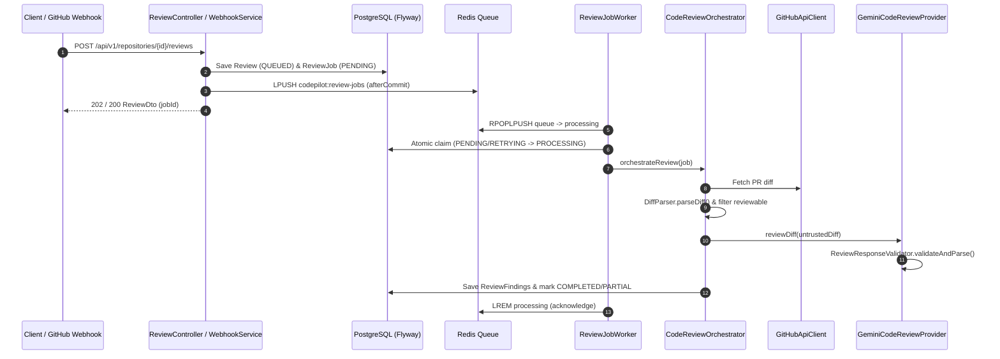

# Review Pipeline Sequence

```mermaid
sequenceDiagram
    autonumber
    participant Client as Client / GitHub Webhook
    participant API as ReviewController / WebhookService
    participant DB as PostgreSQL (Flyway)
    participant Redis as Redis Queue
    participant Worker as ReviewJobWorker
    participant Orch as CodeReviewOrchestrator
    participant GH as GitHubApiClient
    participant AI as GeminiCodeReviewProvider

    Client->>API: POST /api/v1/repositories/{id}/reviews
    API->>DB: Save Review (QUEUED) & ReviewJob (PENDING)
    API->>Redis: LPUSH codepilot:review-jobs (afterCommit)
    API-->>Client: 202 / 200 ReviewDto (jobId)

    Worker->>Redis: RPOPLPUSH queue -> processing
    Worker->>DB: Atomic claim (PENDING/RETRYING -> PROCESSING)
    Worker->>Orch: orchestrateReview(job)
    Orch->>GH: Fetch PR diff
    Orch->>Orch: DiffParser.parseDiff() & filter reviewable
    Orch->>AI: reviewDiff(untrustedDiff)
    AI->>AI: ReviewResponseValidator.validateAndParse()
    Orch->>DB: Save ReviewFindings & mark COMPLETED/PARTIAL
    Worker->>Redis: LREM processing (acknowledge)
```
